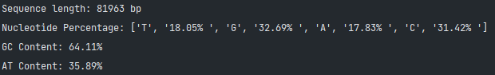

# Rapid_Fasta_Analysis

A tool created for the UCT course.

* This program is used to analyze the genomic sequence of a bacterial genome.
Bacteria is a prokaryotic organism, and therefore it does not have introns.
This program takes a FASTA file and returns various analysis of the sequence.
Output: two fasta files, one with mRNA sequences and some stats about the nucleotide sequence. The other with the
protein sequences and some stats abut the protein sequence.

## Main features
* Process a fasta file. It can be a single sequence or a multiple sequence file. 
* Obtain description and a sequence.
* Return subsequence of a sequence: hypothetical genes and proteins.
* Counting nucleotides in a sequence.
* Computing the GC content of a sequence.
* Computing the melting temperature of a sequence.
* Complementing a strand of DNA.
* DNA to RNA conversion.
* RNA to DNA conversion.

Stats:
* nucleotide seq: GC content, ORFs, start-end, frame, sense, length, trailing 
* protein seq: isoelectric point, molecular weight, instability index, secondary structure
    secondary structures: helix, strand, coil = number predicts probability of being a helix, strand, or coil

## Usage
* Install required packages using the command:
* `pip install -r requirements.txt`
* next, in directory input is located program rapid_fasta_analysis.py
* `python rapid_fasta_analysis.py`
* to start the program.
* Enter the name/path of the file to be analyzed.: It is better to have fasta file and program in the same directory.
  * 
* Sequence averall info will be displayed.
  * 
* Output files will be created.: The output files will be named proteins.fasta and mrna_sequences.fasta. 4 jpg files
  will be created.

For example the file tuberculosis_genomic.fna was used. It is just cca 82000 bp long.
Time consumption is about 10 seconds for this file.
For fasta file with lenght of about 1055550 bp it takes about 30 minutes to complete the analysis.
GCF_000008725.1_ASM872v1_genomic.fna is a file with about 1.05 Mbp long and it is a genome of Chlamydia trachomatis.

